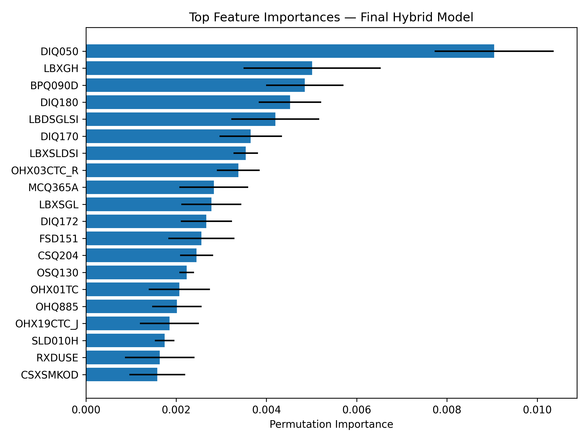

# Hybrid Penalized Regression–MLP Models for Diabetes Prediction  
**EE782 – Advanced Topics in Machine Learning (IIT Bombay)**  
**Author:** Mithra D K  

This repository contains all code, analysis, and the final project report for the study:  
**“Hybrid Penalized Regression–MLP Models for Outcome Prediction in HDLSS Health Data.”**  
The project evaluates whether combining penalized linear models with a compact multilayer perceptron can improve diabetes prediction performance on the NHANES health survey dataset.

---

---

# Project Summary

This project addresses a common issue in health analytics:  
datasets have **many features (P)** but **few samples (N)** → HDLSS.

- Linear models (L1/L2 logistic regression) are stable but limited.
- Neural networks can capture nonlinear patterns but overfit easily.
- A hybrid approach may combine the strengths of both.

This project evaluates:

**Baselines**
- L1 Logistic Regression (LASSO)  
- L2 Logistic Regression  
- Full-feature MLP  

**Hybrid Model**
- Penalized regression → top-k features → deeper MLP

The refined pipeline shows clear improvements in stability, recall, and F1-score.

---

# Dataset Summary

Dataset: **NHANES** (National Health and Nutrition Examination Survey)  
Files used:

- [`demographic.csv`](demographic.csv)
- [`examination.csv`](examination.csv)
- [`labs.csv`](labs.csv)
- [`medications.csv`](medications.csv)
- [`questionnaire.csv`](questionaire.csv)

Final processed dataset after cleaning:
- **4863 samples**
- **1657 features**

Diabetes label rules:
- fasting glucose ≥ 126 mg/dL  
- HbA1c ≥ 6.5%  
- or self-reported diagnosis  

Missing values:
- >50% missing → drop column  
- numeric → median imputation  
- categorical → mode + one-hot encoding  

---

# Methodology Overview

### **1. Baseline Penalized Logistic Regression**
- L1 Logistic Regression (sparse feature selection)
- L2 Logistic Regression (stabilized coefficients)
- Used for:
  - baselines  
  - feature scoring  
  - hybrid top-k selection  

---

### **2. Full-Feature MLP**
- 2 hidden layers (ReLU)
- early stopping
- L2 regularization
- trained on all 1657 features  

---

### **3. Hybrid Penalized Regression → MLP**
The main contribution of the project.

Steps:
1. Select **top-k = 100** features using:
   - absolute L1 coefficients
   - elastic net weights
   - mutual information scores
2. Standardize selected features.
3. Train a deeper MLP (128 → 64).
4. Unified stratified 3-fold cross-validation.
5. Train final hybrid on full dataset.
6. Compute permutation importance.

Motivations:
- Reduce instability from L1 (previously 430, 477, 446 features per fold).
- Improve nonlinear modeling capacity.
- Prevent overfitting in HDLSS regime.

---

# Evaluation Setup

- **3-fold stratified cross-validation**
- Metrics:
  - Accuracy
  - Precision
  - Recall
  - F1-score
  - AUC
- All models trained on standardized inputs
- Saved:
  - scalers
  - models
  - selected feature indices
  - results tables

---

# **RESULTS**

(All results directly taken from EE782_Final_Project.pdf :contentReference[oaicite:1]{index=1})

---

## 1. INITIAL PROTOTYPE RESULTS

This pipeline suffered from instability but gave a baseline.

### **Table: Initial Prototype Performance**

| Model             | Acc    | Prec    | Rec     | F1      | AUC    |
|-------------------|--------|---------|---------|---------|--------|
| L1 Logistic       | 0.9664 | 0.9301  | 0.9269  | 0.9280  | 0.9866 |
| L2 Logistic       | 0.9395 | 0.8452  | 0.9247  | 0.8827  | 0.9791 |
| MLP               | 0.9128 | 0.8551  | 0.7706  | 0.8133  | 0.9526 |
| Hybrid L1–MLP     | 0.9330 | 0.8869  | 0.8360  | 0.8598  | 0.9670 |

### Key Issues
- Hybrid underperformed vs. L1 Logistic.
- L1 feature counts unstable: **430, 477, 446**.
- Motivated design of a refined, stable pipeline.

---

## 2. REFINED HYBRID PIPELINE RESULTS

After redesign (top-k = 100, deeper MLP):

### **Table: Refined Hybrid Performance**

| Model                 | Acc    | Prec    | Rec     | F1      | AUC    |
|-----------------------|--------|---------|---------|---------|--------|
| L1 Logistic           | 0.9664 | 0.9301  | 0.9269  | 0.9280  | 0.9866 |
| L2 Logistic           | 0.9395 | 0.8452  | 0.9247  | 0.8827  | 0.9791 |
| MLP (Full Features)   | 0.9145 | 0.8538  | 0.7870  | 0.8190  | 0.9556 |
| **Hybrid Top-k MLP**      | **0.9679** | **0.9513** | **0.9180** | **0.9338** | **0.9861** |

### Improvements
- Recall ↑  
- F1-score ↑  
- AUC maintained at high level  
- Feature selection stable across folds (always 100)

---

## 3. ROC Curves

- Hybrid MLP’s ROC curve almost overlaps with L1 Logistic.
- Full-feature MLP performs worst due to dimensionality.

---

## 4. Permutation Importance

Top features:
- OSQ130  
- DIQ050  
- RXDRUG_MINOXIDIL  
- cardiovascular medication indicators  
- endocrine medication indicators  

These are clinically meaningful and stable.

---

# Discussion

- HDLSS → instability in naive sparse models.  
- Fixing **k = 100** dramatically stabilizes hybrid architecture.  
- Hybrid combines:
  - **linear stability**  
  - **nonlinear expressiveness**  
- Result: better recall, better F1, same AUC as L1 baseline.  

---

# Conclusion

- L1 logistic regression remains a strong HDLSS baseline.
- Full MLP struggles with high-dimensional data.
- The **hybrid penalized regression + top-k MLP**:
  - improves recall  
  - improves F1  
  - stabilizes feature selection  
  - maintains AUC close to best linear model  
- This pipeline provides a practical, interpretable, and effective approach for real-world health datasets.

---

# 📄 Full Report

---**[EE782_Final_Project.pdf](EE782_Final_Project.pdf)**

# Acknowledgements

This project was completed for **EE782 – Advanced Topics in Machine Learning**,  
**IIT Bombay**.

NHANES dataset provided by NCHS, US Department of Health.

